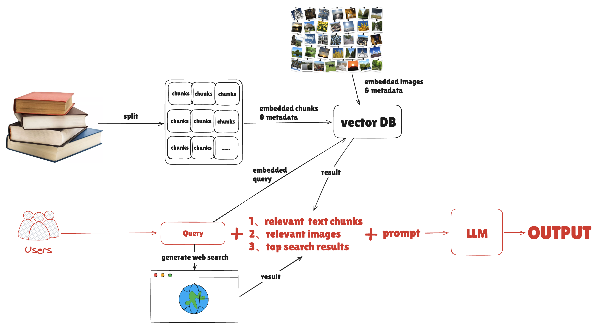

# RAG course - its a WMW project
## how to use
pip install -r requirements.txt

在当前目录(rag-course)执行：
- git lfs install
- git clone https://huggingface.co/OFA-Sys/chinese-clip-vit-base-patch16
- git clone https://huggingface.co/shibing624/text2vec-base-chinese-paraphrase

随后：
1. 在files文件夹内放置你想测试的文档、图片;
2. 运行embed_files.py 建立向量数据库;
3. 运行streamlit run streamlit_search.py ，启动一个简单的web页面实现搜索。

